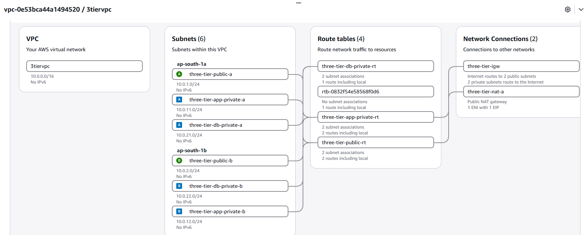
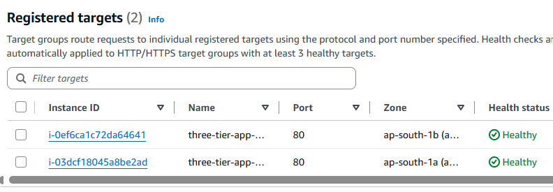
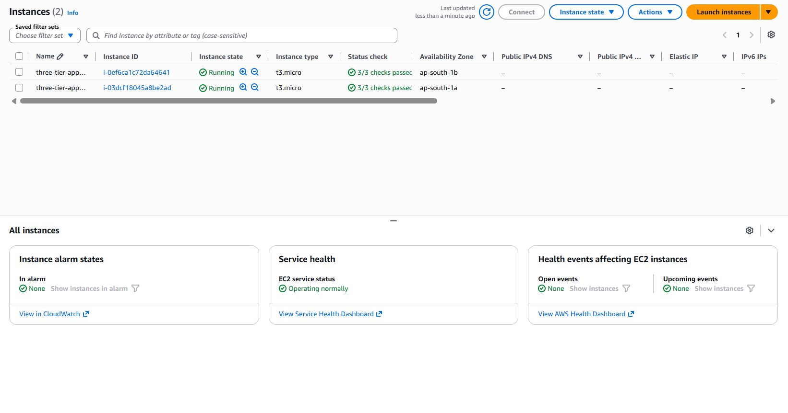
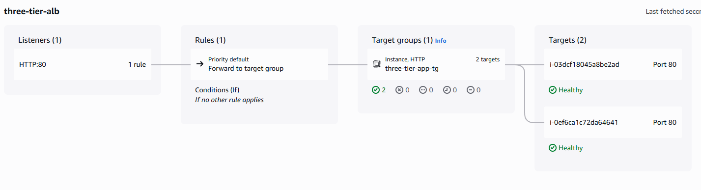
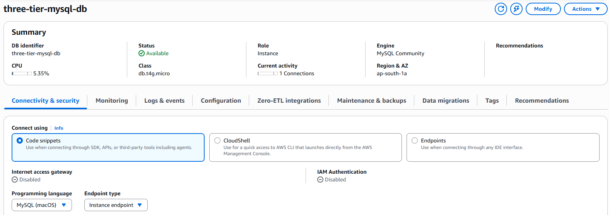
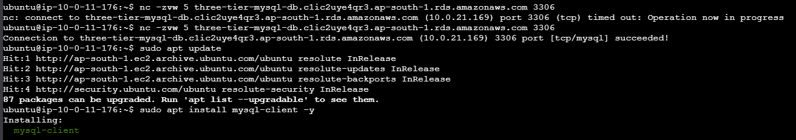

# AWS Secure 3-Tier Architecture

A hands-on implementation of a secure **3-tier architecture on AWS**, designed to understand VPC networking, subnet isolation, routing, load balancing, private compute, database security, and controlled internet access.

The architecture separates resources into **Public, Application, and Database tiers** across **two Availability Zones**.

The application EC2 instances have **no public IP addresses**, the database is **not publicly accessible**, and communication between tiers is controlled using **Security Group-to-Security Group rules**.

---

## Architecture Overview

```text
                         Internet
                            |
                            v
                    Internet Gateway
                            |
                            v
              Application Load Balancer
                   /                 \
                  v                   v
        Private EC2 - AZ A    Private EC2 - AZ B
                  \                   /
                   \                 /
                    v               v
                     Amazon RDS MySQL
                         (Private)

Private EC2 ---> NAT Gateway ---> Internet
     |
     +---- EC2 Instance Connect Endpoint
           for private administration
```

### Traffic Flow

```text
Internet
   |
   | HTTP :80
   v
Internet Gateway
   |
   v
Application Load Balancer
   |
   | HTTP :80
   v
Target Group
   |
   +-------------------+
   |                   |
   v                   v
EC2 App A           EC2 App B
Private IP          Private IP
No Public IP        No Public IP
   |                   |
   +---------+---------+
             |
             | MySQL :3306
             v
       Amazon RDS MySQL
       Not Publicly Accessible
```

---

## AWS Services Used

- Amazon VPC
- Amazon EC2
- Application Load Balancer (ALB)
- Target Groups
- Amazon RDS for MySQL
- NAT Gateway
- Internet Gateway
- EC2 Instance Connect Endpoint
- Security Groups
- Route Tables
- Elastic IP

---

## VPC Design

A custom VPC was created with the following CIDR:

```text
10.0.0.0/16
```

The network contains **6 subnets distributed across 2 Availability Zones**.

| Tier | Availability Zone | CIDR | Purpose |
|---|---|---|---|
| Public | ap-south-1a | `10.0.1.0/24` | ALB / NAT infrastructure |
| Public | ap-south-1b | `10.0.2.0/24` | ALB |
| Application | ap-south-1a | `10.0.11.0/24` | Private EC2 App Server A |
| Application | ap-south-1b | `10.0.12.0/24` | Private EC2 App Server B |
| Database | ap-south-1a | `10.0.21.0/24` | Private RDS subnet |
| Database | ap-south-1b | `10.0.22.0/24` | Private RDS subnet |

### VPC Resource Map



The subnet layout provides clear separation between:

```text
Public Tier
    ↓
Private Application Tier
    ↓
Private Database Tier
```

---

## 1. Public Tier

The public tier contains the internet-facing components of the architecture.

### Application Load Balancer

An **internet-facing Application Load Balancer** acts as the single public entry point for application traffic.

```text
Internet
    ↓
Internet Gateway
    ↓
Application Load Balancer
```

The ALB listens on:

```text
HTTP :80
```

Traffic is forwarded to a Target Group containing the two private application EC2 instances.

### Target Group

Both application servers were registered with the target group on port `80`.

```text
ALB
 |
 +---- EC2 App Server A :80
 |
 +---- EC2 App Server B :80
```

Both targets successfully passed ALB health checks.



This verifies that the load balancer can successfully communicate with application servers located inside private subnets.

---

## 2. Private Application Tier

Two EC2 instances were deployed across separate Availability Zones.

```text
EC2 App Server A
AZ: ap-south-1a
Subnet: 10.0.11.0/24

EC2 App Server B
AZ: ap-south-1b
Subnet: 10.0.12.0/24
```

Both instances:

- Run inside private application subnets
- Have no public IPv4 addresses
- Receive application traffic through the ALB
- Can access the internet outbound through the NAT Gateway
- Can communicate with RDS on MySQL port `3306`



### Why No Public IP?

The application servers do not need to be directly reachable from the internet.

Instead:

```text
Internet
   ↓
ALB
   ↓
Private EC2
```

This reduces the externally exposed attack surface.

Users communicate with the ALB rather than directly with individual EC2 instances.

---

## 3. Load Balancing Across Two Availability Zones

The application tier spans:

```text
ap-south-1a
ap-south-1b
```

The ALB distributes incoming traffic across the two healthy application servers.

```text
                  ALB
                 /   \
                /     \
               v       v

          EC2-A       EC2-B
        ap-south-1a  ap-south-1b
```

### ALB Resource Map



This design improves application-tier availability compared with running a single application server.

> Note: The application/network tier spans two Availability Zones. The RDS instance used in this lab is Single-AZ, so the complete architecture should not be described as fully Multi-AZ/highly available at every tier.

---

## 4. NAT Gateway and Private Internet Access

Private application instances do not have public IP addresses.

However, they may still require outbound internet connectivity for operations such as:

```text
apt update
package installation
software downloads
external API access
```

A NAT Gateway was deployed in a public subnet.

Traffic flow:

```text
Private EC2
    ↓
Private App Route Table
    ↓
NAT Gateway
    ↓
Internet Gateway
    ↓
Internet
```

This allows **outbound connections initiated by private instances** without making those instances directly publicly reachable.

---

## 5. Route Table Design

Separate route tables were used to maintain tier isolation.

### Public Route Table

Associated with the public subnets.

```text
10.0.0.0/16 → local
0.0.0.0/0   → Internet Gateway
```

Used by resources requiring direct internet routing, such as the internet-facing ALB infrastructure and NAT Gateway.

### Private Application Route Table

Associated with:

```text
10.0.11.0/24
10.0.12.0/24
```

Routes:

```text
10.0.0.0/16 → local
0.0.0.0/0   → NAT Gateway
```

This gives private application servers outbound internet connectivity without assigning public IPs.

### Private Database Route Table

Associated with:

```text
10.0.21.0/24
10.0.22.0/24
```

The database tier does not require direct public internet access.

---

## 6. EC2 Instance Connect Endpoint

Because the application EC2 instances have no public IP addresses, direct browser-based/public EC2 Instance Connect cannot be used normally.

An **EC2 Instance Connect Endpoint (EICE)** was created to provide administrative access to the private instances.

Conceptually:

```text
Administrator
      ↓
EC2 Instance Connect
      ↓
EC2 Instance Connect Endpoint
      ↓
Private EC2
```

This allowed access to the application server without making the EC2 instance publicly accessible.

---

## 7. Private Database Tier

Amazon RDS for MySQL was deployed in the database tier.

Configuration:

```text
Engine: MySQL
Public access: Disabled
Port: 3306
DB Subnet Group:
    10.0.21.0/24
    10.0.22.0/24
```

The RDS DB subnet group spans private database subnets across two Availability Zones.

The database itself used for this lab is a **Single-AZ RDS deployment**.

### RDS Configuration



The database is not intended to accept direct connections from the public internet.

The expected application flow is:

```text
Internet
    X
    |
    | No direct DB access
    |
Private RDS
```

Instead:

```text
Application EC2
      |
      | MySQL :3306
      v
Private RDS
```

---

## 8. Security Group Architecture

Security Groups were designed around **tier-to-tier communication** rather than exposing internal services broadly.

### ALB Security Group

Allows:

```text
Inbound:
HTTP :80
Source: Internet
```

### Application Security Group

Allows application traffic from the ALB.

```text
Inbound:
HTTP :80
Source: ALB Security Group
```

This means the EC2 application servers do not need port `80` exposed directly to the entire internet.

### Database Security Group

Allows:

```text
Inbound:
MySQL :3306
Source: Application Security Group
```

Instead of:

```text
MySQL :3306
Source: 0.0.0.0/0
```

the database trusts only resources associated with the application-tier Security Group.

The resulting security chain is:

```text
Internet
   |
   | :80
   v
[ ALB SG ]
   |
   | :80
   v
[ APP SG ]
   |
   | :3306
   v
[ DB SG ]
```

This implements controlled communication between architecture tiers.

---

## 9. Verifying EC2 → RDS Connectivity

Before connecting to MySQL, network connectivity was tested from the private EC2 instance.

```bash
nc -zvw 5 <RDS-ENDPOINT> 3306
```

Successful result:

```text
Connection to <RDS-ENDPOINT> 3306 port [tcp/mysql] succeeded!
```

This confirmed that:

```text
EC2
 ↓
VPC networking
 ↓
Security Groups
 ↓
RDS :3306
```

was functioning correctly.

---

## 10. Verifying the Database Connection

The MySQL client was installed on the private EC2 instance and used to connect to RDS.

```bash
mysql -h <RDS-ENDPOINT> -P 3306 -u admin -p
```

After successful authentication, a test database and table were created.

```sql
CREATE DATABASE three_tier_demo;

USE three_tier_demo;

CREATE TABLE architecture_test (
    id INT AUTO_INCREMENT PRIMARY KEY,
    message VARCHAR(255)
);

INSERT INTO architecture_test (message)
VALUES ('Private EC2 successfully connected to Private RDS!');

SELECT * FROM architecture_test;
```

Result:

```text
+----+------------------------------------------------------+
| id | message                                              |
+----+------------------------------------------------------+
| 1  | Private EC2 successfully connected to Private RDS!  |
+----+------------------------------------------------------+
```



This verifies successful end-to-end communication between the private application and database tiers.

---

## 11. End-to-End Request Flow

### Incoming Application Traffic

```text
User
 ↓
Internet
 ↓
Internet Gateway
 ↓
Application Load Balancer
 ↓
Target Group
 ↓
Private EC2 App Server
```

### Database Traffic

```text
Private EC2
 ↓
App Security Group
 ↓
DB Security Group
 ↓
RDS MySQL :3306
```

### Outbound Internet Traffic

```text
Private EC2
 ↓
Private Route Table
 ↓
NAT Gateway
 ↓
Internet Gateway
 ↓
Internet
```

### Administrative Access

```text
Administrator
 ↓
EC2 Instance Connect
 ↓
EC2 Instance Connect Endpoint
 ↓
Private EC2
```

---

## 12. Troubleshooting and What I Learned

Building the architecture involved troubleshooting several real networking issues rather than only provisioning resources.

### Incorrect Route Table Associations

One issue was caused by associating subnets with the wrong route table.

This reinforced an important concept:

```text
Public Subnet
→ Route to Internet Gateway

Private Application Subnet
→ Default route to NAT Gateway

Private Database Subnet
→ No requirement for direct internet route
```

A subnet is not effectively "public" simply because of its name. Its routing and resource addressing determine how it can communicate.

---

### ALB Connectivity Troubleshooting

The ALB initially required verification of:

- Public subnet associations
- Internet Gateway routing
- ALB Security Group rules
- Listener configuration
- Target Group health checks
- Application server availability

The final target group showed:

```text
2 / 2 Healthy Targets
```

---

### Private EC2 Administration

Since the EC2 application instances had no public IP addresses, normal direct public connectivity was unavailable.

An EC2 Instance Connect Endpoint was used to access the instances while preserving their private network placement.

---

### EC2 → RDS Timeout

Initial connectivity testing to:

```text
RDS :3306
```

timed out.

After inspecting the RDS Security Group and correcting the inbound rule to allow MySQL traffic from the application Security Group, the test succeeded:

```text
3306 port [tcp/mysql] succeeded!
```

This was a useful practical demonstration of how Security Groups control communication between AWS resources.

---

## 13. Key Concepts Practiced

This project provided hands-on experience with:

- VPC CIDR planning
- Public vs private subnets
- Multi-AZ subnet design
- Route table associations
- Internet Gateway routing
- NAT Gateway routing
- Application Load Balancers
- Target Groups and health checks
- Private EC2 instances
- EC2 Instance Connect Endpoint
- RDS DB subnet groups
- Private RDS connectivity
- Security Group referencing
- Network troubleshooting with `nc`
- MySQL connectivity from EC2
- Tier-based network isolation

---

## Security Design Summary

| Component | Publicly Accessible? | Allowed Traffic |
|---|---|---|
| Application Load Balancer | Yes | HTTP `80` |
| EC2 App Server A | No | HTTP from ALB SG |
| EC2 App Server B | No | HTTP from ALB SG |
| RDS MySQL | No | MySQL `3306` from App SG |
| NAT Gateway | Public subnet component | Outbound path for private app tier |

The core security principle used was:

> **Expose only the entry point. Keep application and database resources private, and explicitly allow only the communication required between tiers.**

---

## Architecture Highlights

- Custom `10.0.0.0/16` VPC
- 6 subnets across 2 Availability Zones
- Separate Public, Application, and Database tiers
- Internet-facing Application Load Balancer
- 2 private EC2 application servers
- No public IPs on application servers
- 2/2 healthy ALB targets
- NAT Gateway for controlled outbound connectivity
- EC2 Instance Connect Endpoint for private administration
- Private Amazon RDS MySQL
- Security Group-to-Security Group access control
- Verified EC2 → RDS connectivity
- Successful SQL read/write test

---

## Screenshots

### VPC Network Architecture


### Application Load Balancer


### Healthy Targets Across Two Availability Zones


### Private EC2 Instances


### Private RDS


### Successful EC2 → RDS Test


---

## Future Improvements

This project can be extended with:

- HTTPS using AWS Certificate Manager
- Route 53 custom domain
- Auto Scaling Group for the application tier
- Multi-AZ RDS deployment
- AWS Secrets Manager for database credentials
- AWS WAF in front of the ALB
- CloudWatch monitoring and alarms
- VPC Flow Logs
- Infrastructure as Code using Terraform
- CI/CD pipeline for application deployment

---

## Important Note

This project was built as a **hands-on AWS networking and architecture lab**.

The goal was to understand how AWS networking components work together and how to securely connect public-facing, private application, and private database tiers.

Sensitive credentials, passwords, private keys, and secrets are not included in this repository.

---

## Author

**Ayush Kumar Pandey**

If you found this project useful, feel free to ⭐ the repository.
